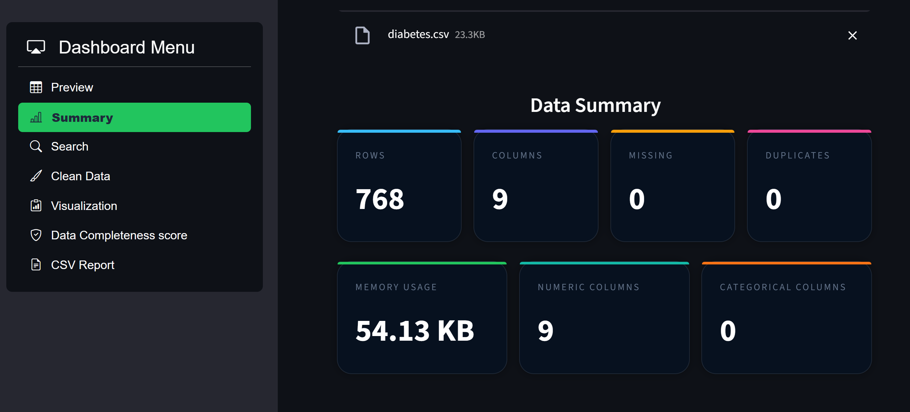
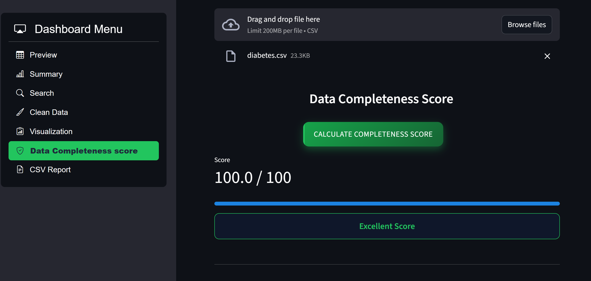
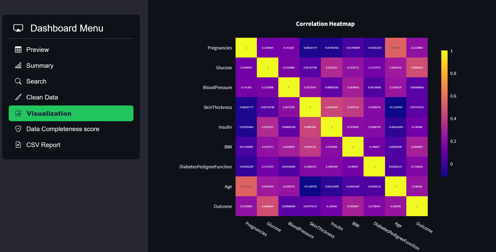

# CSV DataLens

> An interactive, dark-themed CSV analytics dashboard built with Streamlit — upload your data, explore it visually, clean it intelligently, and export a professional PDF report in seconds.

---

## Overview

**CSV DataLens** is a fully featured, browser-based data exploration tool that transforms raw CSV files into actionable insights through an elegant, dark-mode dashboard. No coding required — just upload, click, and analyze.

Whether you're a data analyst looking for a quick EDA tool, a student validating a dataset, or a developer prototyping a data pipeline, CSV DataLens gives you everything you need in one place.

---

## Features

| Feature | Description |
|---|---|
| **Dataset Preview** | Scroll through your full dataset in a styled, responsive table |
| **Summary Statistics** | Instant overview — row/column counts, missing values, duplicates, memory usage, data types, and descriptive stats |
| **Live Search** | Search any value across the entire dataset with real-time highlighted results |
| **Data Cleaning** | One-click cleaning actions — drop nulls, remove duplicates, smart numeric imputation, outlier removal via IQR |
| **Visualization** | Interactive Plotly charts — Line, Scatter, Bar, Histogram, Pie, and Correlation Heatmap |
| **Completeness Score** | Composite data quality score (0–100) based on missing values, duplicates, completeness, and numeric ratio |
| **PDF Report** | Auto-generated professional report with summary, data types, statistics, heatmap, and quality score |

---

## Tech Stack

- **[Streamlit](https://streamlit.io/)** — Web app framework
- **[Pandas](https://pandas.pydata.org/)** — Data manipulation and analysis
- **[Plotly Express](https://plotly.com/python/plotly-express/)** — Interactive visualizations
- **[Matplotlib](https://matplotlib.org/) + [Seaborn](https://seaborn.pydata.org/)** — Heatmap generation for PDF export
- **[ReportLab](https://www.reportlab.com/)** — PDF report generation
- **[streamlit-option-menu](https://github.com/victoryhb/streamlit-option-menu)** — Sidebar navigation

---

## Getting Started

### Prerequisites

Make sure you have **Python 3.8+** installed.

### Installation

```bash
# 1. Clone the repository
git clone https://github.com/your-username/csv-datalens.git
cd csv-datalens

# 2. (Recommended) Create and activate a virtual environment
python -m venv venv
source venv/bin/activate        # On Windows: venv\Scripts\activate

# 3. Install dependencies
pip install -r requirements.txt

# 4. Run the application
streamlit run app.py
```

The app will open automatically in your browser at `http://localhost:8501`.

---

## Requirements

Create a `requirements.txt` with the following:

```
streamlit
pandas
plotly
matplotlib
seaborn
reportlab
streamlit-option-menu
```

---

## Project Structure

```
csv-datalens/
│
├── app.py                  # Main Streamlit application
├── requirements.txt        # Python dependencies
└── README.md               # Project documentation
```

---

## Dashboard Sections

### 1. Preview
Renders the entire dataset in a custom-styled HTML table with hover effects and horizontal scroll support for wide datasets.

### 2. Summary
Displays seven key metrics across two rows of cards, followed by a data type breakdown table and a detailed statistical summary (mean, std, min, quartiles, max) for all numeric columns.

### 3. Search
Real-time full-dataset search with case-insensitive matching and highlighted keyword markers directly within the table cells.

### 4. Clean Data
Five configurable cleaning operations with an applied-actions log and live row/column counters. The cleaned dataset can be downloaded as a new CSV file.

| Action | Behavior |
|---|---|
| Drop All Null Rows | Removes every row containing at least one null value |
| Smart Numeric Clean | Drops columns with >60% missing; fills the rest with median |
| Remove Duplicates | Drops all exact duplicate rows |
| Clean Text Rows | Drops rows with null values in object/string columns |
| Remove Outliers (IQR) | Filters rows outside 1.5× IQR for all numeric columns |

### 5. Visualization
Six fully interactive Plotly charts rendered inside the dark template. X/Y axis selectors are dynamically populated from your dataset's column types.

### 6. Data Completeness Score
Calculates a normalized 0–100 quality score from four equal-weight factors:

```
Score = ((1 - missing_ratio) + (1 - dup_ratio) + completeness + numeric_ratio) / 4 × 100
```

Ratings: **≥ 80** → Excellent | **50–79** → Moderate | **< 50** → Poor

### 7. CSV Report
Generates a multi-page PDF containing the dataset overview, data type summary, statistical table, correlation heatmap image, and completeness score — downloadable directly from the browser.

---

## Contributing

Contributions are welcome! If you'd like to improve CSV DataLens:

1. Fork the repository
2. Create a new branch (`git checkout -b feature/your-feature-name`)
3. Commit your changes (`git commit -m 'Add: your feature description'`)
4. Push to the branch (`git push origin feature/your-feature-name`)
5. Open a Pull Request

Please ensure your code follows consistent formatting and includes comments where necessary.

---

## Screenshots

### Data Summary


### completeness_score.png


### Visualization


### Report_pg1
.

---

## Author

**Parv Shah**

Built with Streamlit. Feel free to open an issue for bugs, feature requests, or questions.
